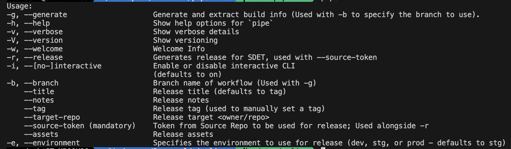

# Pipeline CLI

This CLI is created to allow us to rework and clean up our workflows by replacing it with equivalent Dart methods that can be made reusable. This will help us extend our current solution with ease. It can, for example, be used to gather and create a file with the latest information or allow us to do releases to another repository.

---

## Installing

In ``rank_mobile_core/`` use the following to *install* the CLI:

```bash
make cli
```

or

```sh
dart pub global activate -s path ./pipeline_cli
dart pub global run ./pipeline_cli
```

Use the following to confirm the installation:

```bash
dart pub global list  
```

with output looking something like `pipeline 0.0.2 at path "/Users/...`

Unistall to update then reinstall install:

```bash
dart pub global deactivate pipeline  
dart pub global activate -s path ./pipeline_cli
```

**Alternatively:**
Use `make cli` to reinstall all CLI's.

---

## Usage

```bash
pipe --welcome
```

OR

```bash
pipe -w
```

### Generate contents

To extract and generate a build's info, use the `-g` flag and pass in the branch name requested interactively where the workflow is running from. Alternatively, use `-b <branch_name>` with `-g`:

```sh
pipe -g
```

or without the interactivity

```sh
pipe -g --branch <branch-name>
```

**Write to File**
To write the contents to a file, use

```sh
pipe -g --branch <branch-name> >> fileName.txt
```

### Create a Release

For the purpose of creating releases in another repository, for example [riga_auto_testing](https://github.com/rankengineering/riga_auto_testing), we can use the `-r` flag with a `--source-token`. This can be done either interactively through the terminal or it can be used in our workflows with the `--no-interactive` flag set.

> **Workflows vs Local**
> When using the release flag in a workflow, it is important to use the `--no-interactive` flag since this will ensure that the values are dynamically added and not waiting for user input.

#### Usage

Using it in the terminal

```sh
pipe -r --source-token <your-token>
```

with the rest of the information prompted from the user. Or alternatively, by using the `--no-interactive` flag and passing in any required or custom data.

```sh
pipe -r --source-token <your-token> 
    --notes "This is a note" 
    --assets <path-to-asset> 
    --target-repo <OWNER/REPOSIRY> 
```

**Here is a list of available options:**

- `--tag`: Used to specify a custom release tag (otherwise, a tag in the form of `version_build.type.env` or `1.0.0_123.RC.Staging` read from the pubspec.yaml).
- `--title`: Used to specify the release title (defaults to release tag).
- `--notes`: Used to specify either the release notes or the path to it.
- `--target-repo`: Used to specify the target repo where the release should be created as `<OWNER/REPOSITORY>`.
- `--source-token`: Used to specify the source repo token where the release is done from.
- `--assets`: Used to specify a list of paths to the assets to include with the release.
- `-b, --branch`: Used to get the type of release, either `QA` or `RC`.
- `-e, --environment`: Used to specify the environment for the release tag, either `Development, Staging, Production`.

---

## Flags and Options



### Flags

- `-g, --generate`: Used along side `-b` to generate the build info as a string
- `-h, --help`: Used to display all features and usage
- `-v, --verbose`: Used as verbose
- `-V, --version`: Used to check CLI version
- `-w, --welcome`: Used to display a welcome message
- `-r, --release`: Used to create a release in a given repository
- `-i, --[no-]interactive`: Enable or disable the interactive CLI

### Options

- `-b, --branch`: Used with flag `-g` to specify the branch to use or used with `-r` to specify which type to include in the release tag.
- `-e, --environment`: Used to specify the environment for the release tag.
- `--tag`: Used to specify a custom release tag.
- `--title`: Used to specify the release title (defaults to release tag).
- `--notes`: Used to specify either the release notes or the path to it.
- `--target-repo`: Used to specify the target repo where the release should be created.
- `--source-token`: Used to specify the source repo token where the release is done from.
- `--assets`: Used to specify a list of paths to the assets to include with the release.

---

## Additional information

*Documentation* can be found here [Pipeline CLI and Slack Bot](https://daubltd.atlassian.net/wiki/x/OACMMzI), or specifically the `release` process here [Release Process](https://daubltd.atlassian.net/wiki/x/BAD0NDI).

Author: Zander Kotze
Date: 16 September 2024
